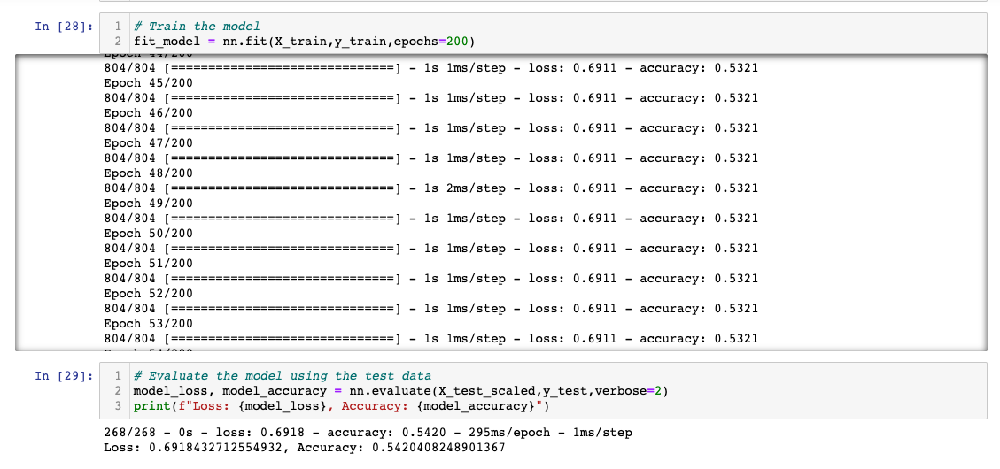
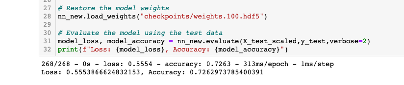

# Neural_Network_Charity_Analysis

## Overview of Analysis
From Alphabet Soup’s business team, we received a CSV containing more than 34,000 organizations that have received funding from Alphabet Soup over the years. We used the features in the dataset to help create a binary classifier that is capable of predicting whether applicants will be successful if funded by Alphabet Soup.

## Results
## Data Preprocessing
#### What variable(s) are considered the target(s) for your model?
- The target is considered the 'IS_SUCCESSFUL' column, determining if the applicant was successful or not

#### What variable(s) are considered to be the features for your model?
- The variables would include the remaining columns except for 'IS_SUCCESSFUL', or the identification columns, 'EIN' and 'NAME'.

#### What variable(s) are neither targets nor features, and should be removed from the input data?
- The identification columns are neither targets nor features and we removed them from the input data.

## Compiling, Training, and Evaluating the Model
#### How many neurons, layers, and activation functions did you select for your neural network model, and why?
- I used two hidden layers, the first one with 80 neurons and the second one with 30 neurons
- The first layer's neurons has about twice the amount of inputs, which was 44

#### Were you able to achieve the target model performance?
- After the model was trained, the accuracy rate was 72.6%
- The loss was 55.6%

#### After Optimization:

After training it for 200 epochs after optimization, these were the results:

After testing it for 100 epochs after optimization, these were the results:

#### What steps did you take to try and increase model performance?
For optimization I did the following:
- Removed the special_considerations column from the dataset
- Added 100 more epochs to the training regimen
- Added a third hidden layer with 10 neurons
- Added neurons to the first layer, 90 neurons
- Added neurons to the second layer, 40 neurons
- Switched the activation from relu to tanh

## Summary
The overall results did not achieve accuracy higher than 75% unfortuntaley after using the above steps to increase performance.
- My recommendation would be to provide the model more data to work with. 
- I would also recommend visualizing the feature in order to really guage which activation function, number of layers and number of neurons to use. 
